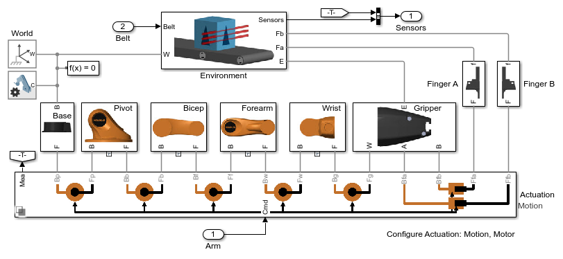
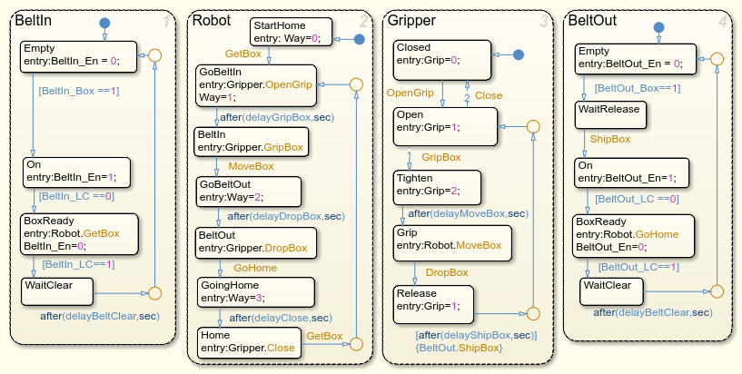

# **Robot Arm with Conveyor Belts**
Copyright 2016-2023 The MathWorks(TM), Inc.

Models a robot arm with 5 degrees of freedom and a gripper, along with 
two conveyor belts.  The robot transfers a block from one conveyor belt
to the other.  One conveyor belt brings the block to the robot arm,
and the other belt transports the block away from the robot arm.

Open YouBot_Arm.prj to get started.

View on File Exchange:   
You can also open in MATLAB Online: 

Variant subsystems permit the model user to configure the robot arm
for different tests: 
    1. Full test with conveyor belts, load, and logic (default)
    2. Box transfer test
    3. Joint tests
It is recommended to use the hyperlinks at the top level of the model
to configure tests.

Variant subsystems are also used to configure the level of fidelity
for actuation and contact modeling between the gripper and the block.
Hyperlinks within the model enable you to select the appropriate level
of fidelity for your test.
    1. Actuation: Ideal (prescribed motion), Motor (ideal), Motor (electric)
    2. Gripper-block contact: Damper, Penalty, Payload
       For Box transfer and joint tests, it is recommended to use Payload

## **Main Model**

## **Mechanical Model of Arm**

## **Actuation Model**

## **Motor Model**

## **Logic Controller**
